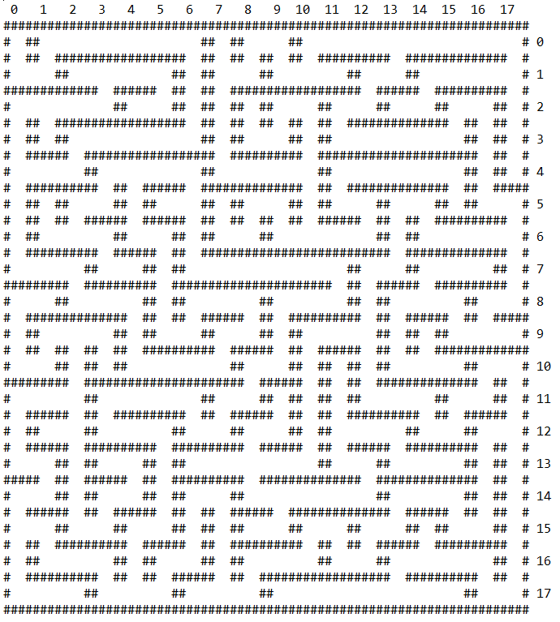
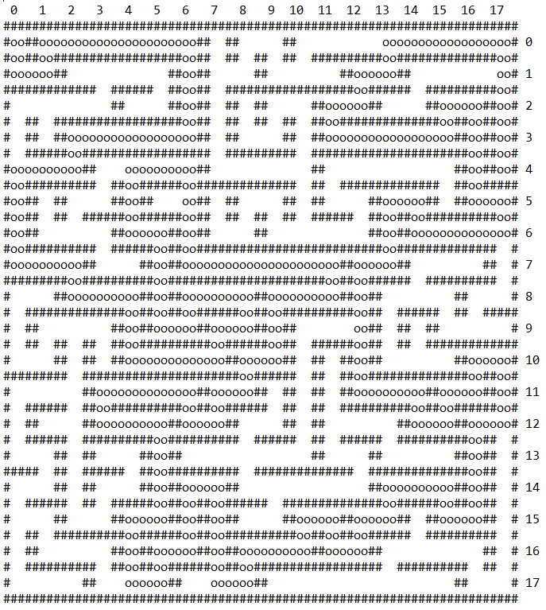

# Maze Generator & Solver
Generates a perfect maze after size has been inputted, meaning there is only one solution for getting to one cell to another. Then the user can input the coordinates of the entrance and exit and then the solution for the maze is found. Both the maze generation and solving are achieved using a **backtracking algorithm**!

This was a very fun project to work on. I initially explored different ways to tackle the maze generation and found the backtracking algorithm to best meet to my expectations. Instead of using C++ modules I coded everything using vanilla C++ (created my own stack class for example). I'm very happy with the outcome! :)

**Maze of size 18x18 generated::**

&nbsp;
&nbsp;

**Then solved with entrance (0, 0) and exit (17, 4):**

&nbsp;
&nbsp;

